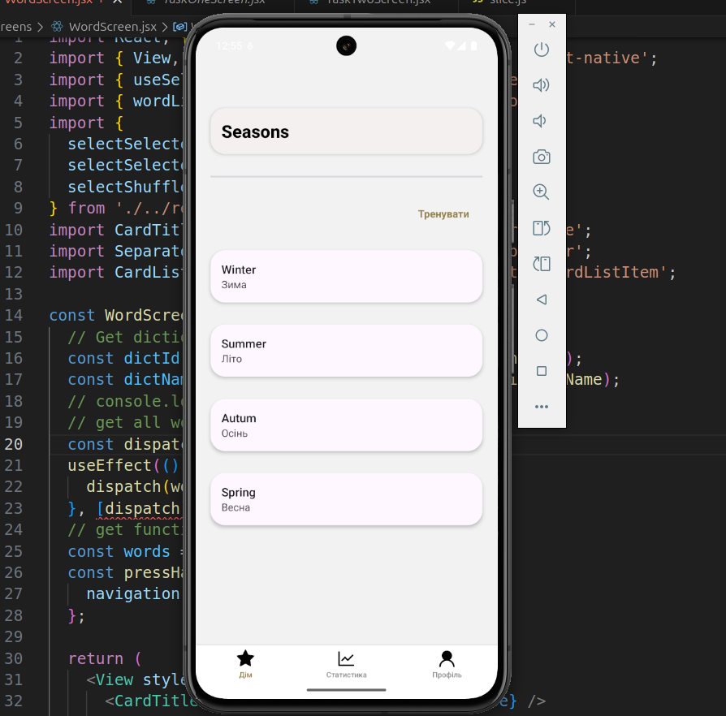
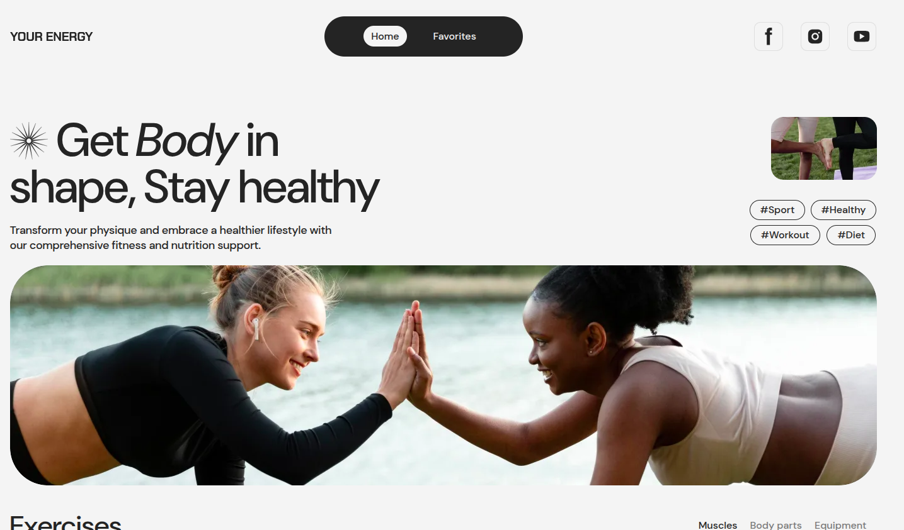
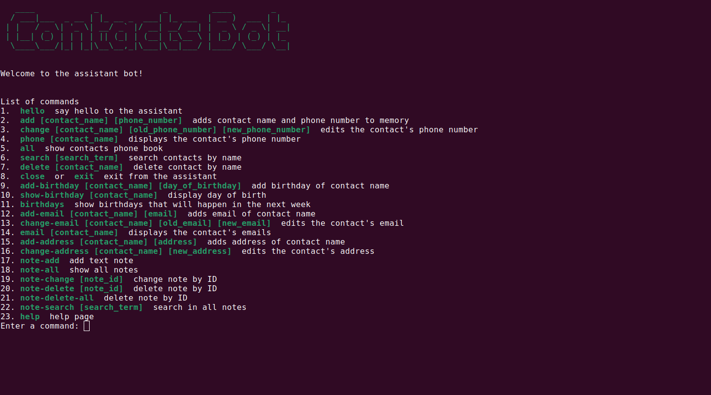
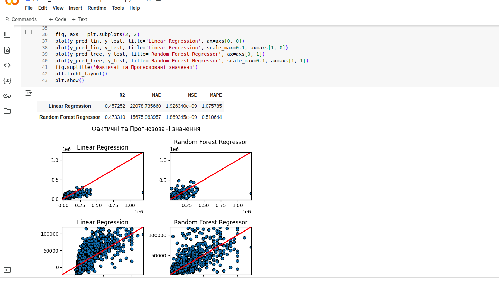

### &#x1F578; Simple Words Trainer
> Mobile App
> 

:paperclip: Project [GitHub Repo](https://github.com/PavloRohozhyn/MobileApp) 
:paperclip: Live Demo [Simple Words Trainer](https://vimeo.com/1121125212)

### &#x1F578; Travel Trucks
> Web Application
> 

:paperclip: Project [GitHub Repo](https://github.com/PavloRohozhyn/TravelTrucks)
:paperclip: Live Demo [TravelTrucks](https://travel-trucks-three-wheat.vercel.app)

### &#x1F578; Your Energy 
> Web Application
> 

:paperclip: Project [GitHub Repo](https://github.com/PavloRohozhyn/goit-markup-hw-final)
:paperclip: Team Project [GitHub Repo](https://github.com/uanvi/goit-adv-js-final-project-team-5)
:paperclip: Live Demo [Your Energy](https://uanvi.github.io/goit-adv-js-final-project-team-5/)

### &#x1F578; English Excellent
> Web Application
> 

:paperclip: Project [GitHub Repo](https://github.com/PavloRohozhyn/goit-markup-hw-final)
:paperclip: Team Project [GitHub Repo](https://github.com/krav-yurii/english-excellence-v2)
:paperclip: Live Demo [English Excellent](https://pavlorohozhyn.github.io/goit-markup-hw-final)

### :film_projector: Images Gallery 
> Web Application
> 

:paperclip: Project [GitHub Repo](https://github.com/PavloRohozhyn/goit-js-hw-08)
:paperclip: Live Demo [Images Gallery](https://pavlorohozhyn.github.io/goit-js-hw-08/)

### &#x1F578; Web Studio
> Web Application
> 

:paperclip: Project [GitHub Repo](https://github.com/PavloRohozhyn/goit-markup-hw-06)
:paperclip: Live Demo [Web Studio](https://pavlorohozhyn.github.io/goit-markup-hw-06/)

### &#x1F578; Contact, Note Management Console Aplication
> Console Application
> 

:paperclip: Project [GitHub Repo](https://github.com/PavloRohozhyn/goit-pycore-final)
:paperclip: Team Project [GitHub Repo](https://github.com/MaksVeter/goit-pycore-final-project)

### &#x1F578; Decision-Making Methods
> Colab Project
> 

:paperclip: Project [Colab Notebook](https://colab.research.google.com/drive/1oRjUGFpTDzmBxTzJgad1Iu7TQSMJhouu?usp=sharing)

___

                                            <!-- Else -->   

